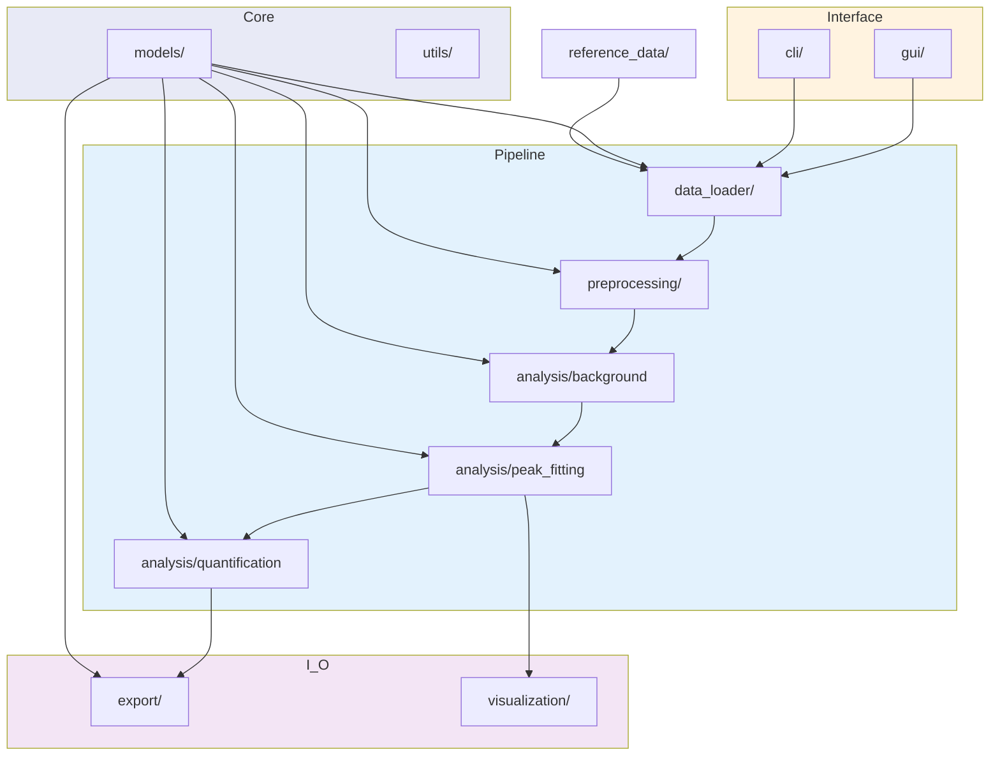
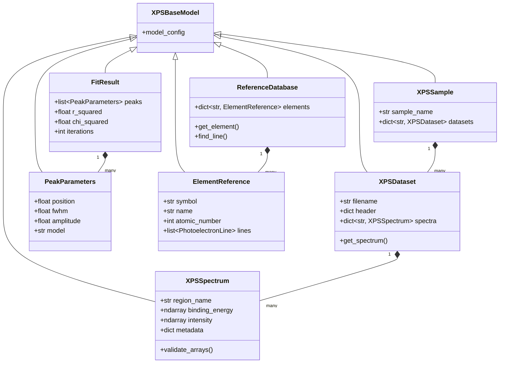

# System Architecture

## Design Principles

1. **Immutability by default** — Original data is never modified. All operations return
   deep copies via `model_copy(deep=True)`.
2. **Separation of concerns** — Each module has a single, well-defined responsibility.
3. **Robust runtime validation** — Pydantic v2 enforces spectral data integrity.
4. **Explicit configuration** — All parameters have documented defaults.
5. **Extensibility** — Architecture supports plugin-based future extensions.

## Module Architecture

## Data Model Hierarchy

## Technology Stack

| Layer | Technology | Purpose |
|-------|-----------|---------|
| **Language** | Python &ge; 3.10 | Type-hinted, scientific ecosystem |
| **Data Validation** | Pydantic v2 | Runtime type safety, serialization |
| **Numerical** | NumPy &ge; 1.21 | Vectorized array operations |
| **Signal Processing** | SciPy &ge; 1.7 | Interpolation, integration |
| **Curve Fitting** | lmfit &ge; 1.0 | Levenberg-Marquardt optimization |
| **Plotting** | Matplotlib &ge; 3.4 | Publication-quality figures |
| **GUI** | Streamlit &ge; 1.31 | Interactive data exploration |
| **CLI** | Click &ge; 8.0 | Terminal interface |
| **Testing** | pytest | 355+ tests, 93% coverage |
| **Linting** | ruff | Code quality enforcement |

## Validation System

`XPSBaseModel` provides:

- `arbitrary_types_allowed = True` — enables NumPy array fields
- `validate_assignment = True` — validates on attribute mutation

### Critical Validators

1. **Array length matching:** `len(binding_energy) == len(intensity)`
2. **Positive energy:** `all(binding_energy > 0)`
3. **Non-negative intensity:** `all(intensity >= 0)`
4. **Physical peak bounds:** FWHM > 0, peak position within $\pm$5 eV of initial guess

## Configuration System

Global defaults are loaded from `config/default_settings.toml` at import time.
Configuration categories:

| Section | Parameters |
|---------|-----------|
| `[background]` | Model type, convergence tolerance, energy range |
| `[peak_fitting]` | Lineshape model, FWHM bounds, iteration limit |
| `[calibration]` | Reference element, energy tolerance |
| `[quantification]` | RSF database, correction factors |
| `[export]` | Format, precision, metadata inclusion |
| `[plotting]` | Figure size, colormap, grid style |

Instrument-specific profiles are stored in `config/instrument_profiles.toml` and
element reference data in `config/element_database.toml`.
