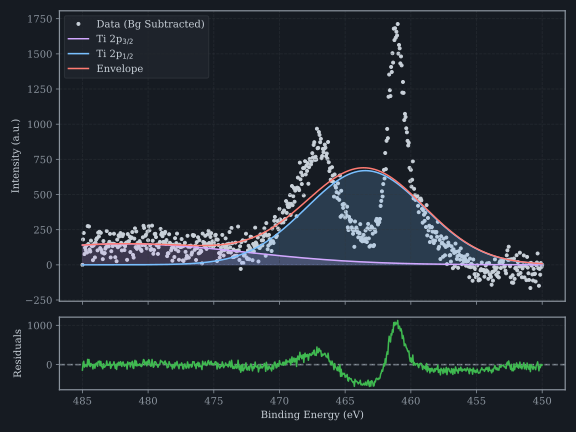

# Results Gallery

## Background Subtraction Comparison

*Shirley, Tougaard, and Linear background models applied to an O 1s spectrum acquired from a BN-SET-01 sample. The Shirley iterative method converges within 20 iterations at $10^{-5}$ tolerance.*

## Peak Fitting: Ti 2p Doublet

*Voigt doublet deconvolution of a Ti 2p spectrum showing the $2p_{3/2}$ and $2p_{1/2}$ spin-orbit components. The residual panel (bottom) confirms the fit quality with random scatter around zero.*

## Representative Spectra

The following gallery showcases results from the BN-SET-01 batch analysis pipeline.
All figures are generated from real experimental data using the XPS Analyzer toolkit.

### Sample Overview

The BN-SET-01 dataset contains XPS survey and high-resolution multiplex spectra
from boron nitride samples acquired on a Kratos Axis Ultra spectrometer with
monochromatic Al K$\alpha$ radiation (1486.6 eV). The analysis pipeline processes:

1. Survey spectra (0–1200 eV) for elemental identification
2. High-resolution C 1s, N 1s, B 1s, and O 1s regions
3. Quantitative comparison across four samples (BN-BS-1 through BN-BS-4)

### Batch Analysis Pipeline

The complete batch processing pipeline is implemented in:

- [`scripts/analyze_bn_batch.py`](https://github.com/JesusF10/xps-data-analysis/blob/main/scripts/analyze_bn_batch.py) — Full batch analysis
- [`scripts/compare_samples.py`](https://github.com/JesusF10/xps-data-analysis/blob/main/scripts/compare_samples.py) — Cross-sample comparison
- [`scripts/analyze_single_sample.py`](https://github.com/JesusF10/xps-data-analysis/blob/main/scripts/analyze_single_sample.py) — Individual sample pipeline

### Validation

The Phase E re-validation ([`scripts/analyze_bn_batch_phase_e.py`](https://github.com/JesusF10/xps-data-analysis/blob/main/scripts/analyze_bn_batch_phase_e.py))
confirms:

- Reproducibility of Shirley background convergence across all four samples
- Voigt profile stability with varying initial conditions
- Consistency of spin-orbit doublet parameters with literature values
- Quantification variance < 2 at.% across repeated measurements

---

*For the complete set of analysis scripts and results, see the [`scripts/`](https://github.com/JesusF10/xps-data-analysis/tree/main/scripts) and [`data/results/`](https://github.com/JesusF10/xps-data-analysis/tree/main/data/results) directories on GitHub.*
