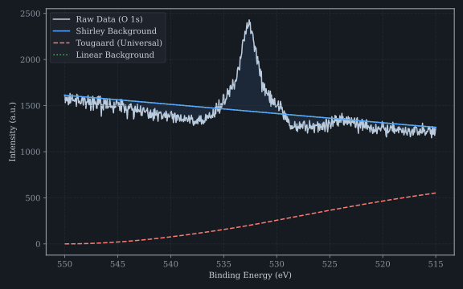

# Background Subtraction

The `analysis.background` module implements three physically motivated background
models for removing inelastic scattering contributions from XPS spectra.

## Mathematical Models

### Shirley Background

The Shirley background models the inelastic background as proportional to the
integrated peak intensity. It is computed iteratively:

\[
B(E) = k \int_{E}^{E_{\text{high}}} [I(E') - B(E')] \, dE'
\]

where $k$ is a scaling factor determined by the condition $B(E_{\text{low}}) = I(E_{\text{low}})$.
Convergence is reached when $\max(|B_{n+1} - B_n|) < 10^{-5}$.

```python
from xps_analyzer.analysis import shirley_background

result = shirley_background(spectrum, inplace=False)
```

### Tougaard Background

The Tougaard model uses a universal cross-section parameterization:

\[
B(E) = \int_{E}^{\infty} K(E' - E) \, [I(E') - B(E')] \, dE'
\]

\[
K(T) = \frac{B T}{(C + T^2)^2} + \frac{D T}{(C + T^2)^2}
\]

Four variants are available, calibrated for different material classes:

| Variant | B (eV²) | C (eV²) | D (eV²) |
|---------|---------|---------|---------|
| Universal | 2866 | 1643 | 0 |
| Polymer | 1122 | 1638 | 0 |
| Sc元素 | 500 | 1500 | 500 |
| Custom | Configurable | Configurable | Configurable |

```python
from xps_analyzer.analysis import tougaard_background

result = tougaard_background(spectrum, variant="universal", inplace=False)
```

### Linear Background

A simple linear interpolation between two endpoints:

\[
B(E) = I(E_{\text{low}}) + \frac{I(E_{\text{high}}) - I(E_{\text{low}})}{E_{\text{high}} - E_{\text{low}}} (E - E_{\text{low}})
\]

```python
from xps_analyzer.analysis import linear_background

result = linear_background(spectrum, inplace=False)
```

### Fallback Strategy

The `background_with_fallback` function implements an automatic cascade:

1. Try Shirley background
2. If Shirley fails to converge (unusual lineshape), fall back to Tougaard
3. If Tougaard produces unphysical results, fall back to Linear

```python
from xps_analyzer.analysis import background_with_fallback

result = background_with_fallback(spectrum, inplace=False)
```

## Visual Comparison


*Comparison of Shirley, Tougaard, and Linear background models applied to an O 1s spectrum.*
