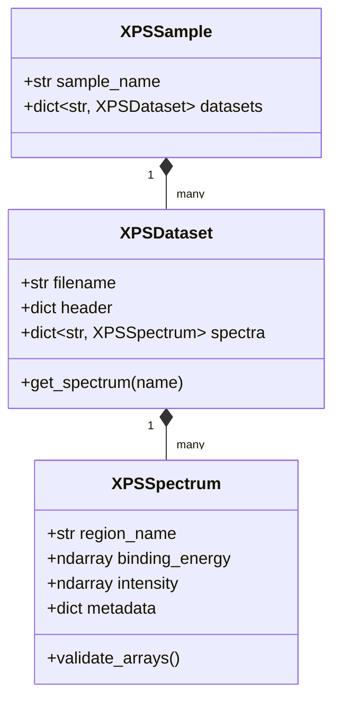

# Data Loading

The `data_loader` module parses raw XPS instrument files into typed Pydantic models.
It supports automatic format detection and returns structured containers at the
spectrum, file, and sample levels.

## Architecture



## Data Model Hierarchy

- **`XPSSpectrum`** — single region scan with `binding_energy` and `intensity` NumPy arrays. Validates array length consistency and positive energy values.
- **`XPSDataset`** — one physical file. Contains a `header` dictionary (instrument parameters, acquisition metadata) and a mapping of region names to `XPSSpectrum` objects.
- **`XPSSample`** — logical grouping of datasets (e.g., all measurements from one sample).

## Core Functions

### load_single_file

```python
from xps_analyzer import load_single_file

dataset = load_single_file("data/raw/samples/sample.txt")
```

Auto-detects file format from extension and content headers. Returns an `XPSDataset`.

### load_all_data

```python
from xps_analyzer import load_all_data

samples = load_all_data("data/raw/BN-SET-01")
```

Scans a directory recursively, loads all supported files, and returns a list of `XPSDataset` objects.

### Spectrum Access

```python
# By region name
c1s = dataset.get_spectrum("C 1s")
survey = dataset.get_spectrum("Survey")

# Iterate all spectra
for name, spectrum in dataset.spectra.items():
    print(f"{name}: {len(spectrum.binding_energy)} points")
```

## Supported Formats

| Format | Detection Method |
|--------|-----------------|
| VMS (VGX900) | Header signature + `.vms` extension |
| TXT (columnar) | Auto-detected column delimiter |
| CSV | `.csv` extension, comma-delimited |
| Custom ASCII | Configurable via `config/default_settings.toml` |

## Validation

Each `XPSSpectrum` undergoes automatic validation on construction:

- `len(binding_energy) == len(intensity)` — dimension consistency
- `all(binding_energy > 0)` — physically meaningful energy axis
- `all(intensity >= 0)` — non-negative intensities

If validation fails, a `ValidationError` is raised with specific details about the constraint violated.
