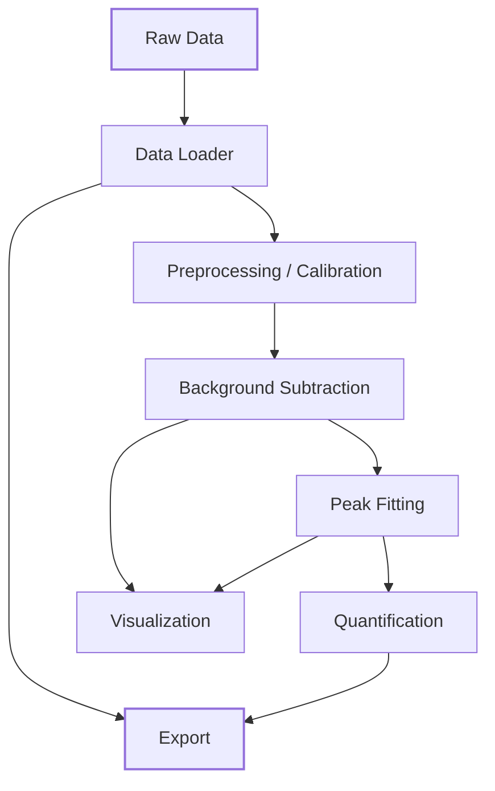

# User Guide

The XPS Analyzer pipeline is organized into six modular stages. Each stage operates
independently and communicates through validated Pydantic data models, ensuring
type safety and data integrity throughout the analysis.

## Pipeline Overview

## Module Reference

| Module | Page | Purpose |
|--------|------|---------|
| `data_loader` | [Data Loading](data-loader.md) | File parsing, format detection, spectrum structuring |
| `preprocessing` | [Energy Calibration](preprocessing.md) | Binding energy shift correction |
| `analysis.background` | [Background Subtraction](background.md) | Shirley, Tougaard, and Linear background models |
| `analysis.peak_fitting` | [Peak Fitting](peak-fitting.md) | Voigt/Gaussian/Lorentzian deconvolution, doublet fitting |
| `analysis.quantification` | [Atomic Quantification](quantification.md) | RSF-based concentration calculation |
| `export` | [Data Export](export.md) | CSV, Excel, and JSON serialization |

## Code Conventions

- **Immutability:** All spectral operations return new model instances via `model_copy(deep=True)`. Set `inplace=True` to override.
- **Validation:** All models use Pydantic v2 validators. Invalid data raises typed exceptions at construction time.
- **Configuration:** Global defaults in `config/default_settings.toml` can be overridden per call.
