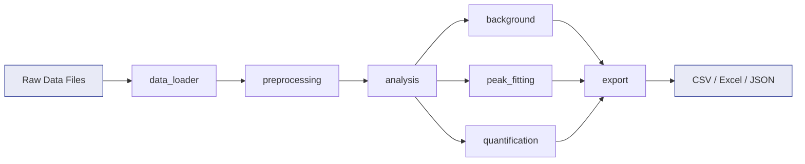

# XPS Analyzer

<div class="hero">
  <p>
    A mathematically rigorous, type-safe Python package for automated X-ray Photoelectron
    Spectroscopy data analysis. Built with Pydantic v2 validation, NumPy vectorization,
    and non-linear optimization via lmfit.
  </p>

  <div class="badge-row">
    
    
    
    
    
  </div>

  <div class="hero-cta">
    <a href="installation/" class="md-button md-button--primary">Get Started</a>
    <a href="guide/" class="md-button">User Guide</a>
    <a href="api/" class="md-button">API Reference</a>
  </div>
</div>

## Design Principles

<div class="feature-grid">
  <div class="feature-card">
    <h3>Immutability by Default</h3>
    <p>
      Raw spectral data is never modified in place. Every operation returns a deep copy
      via <code>model_copy(deep=True)</code>, preserving full provenance.
    </p>
  </div>
  <div class="feature-card">
    <h3>Runtime Validation</h3>
    <p>
      Pydantic v2 enforces array dimension consistency, positive energy values, and
      physically meaningful parameter ranges at every stage.
    </p>
  </div>
  <div class="feature-card">
    <h3>Algorithmic Transparency</h3>
    <p>
      Shirley, Tougaard, and Voigt implementations are documented with their mathematical
      formulations. No black-box approximations.
    </p>
  </div>
  <div class="feature-card">
    <h3>Separation of Concerns</h3>
    <p>
      Six independent modules — data loading, preprocessing, analysis, reference data,
      export, and visualization — each with a single responsibility.
    </p>
  </div>
  <div class="feature-card">
    <h3>Explicit Configuration</h3>
    <p>
      All algorithmic parameters (convergence tolerances, broadening models, RSF databases)
      have documented defaults and are fully overridable via TOML profiles.
    </p>
  </div>
  <div class="feature-card">
    <h3>Interoperable I/O</h3>
    <p>
      Export results to CSV, Excel, or JSON. Custom NumPy encoder preserves array types
      in JSON serialization. Streamlit GUI for interactive exploration.
    </p>
  </div>
</div>

## Quick Example

```python
from xps_analyzer import load_single_file
from xps_analyzer.analysis import shirley_background, fit_voigt, calculate_atomic_concentration
from xps_analyzer.export import export_to_excel

# Load spectrum with automatic format detection
dataset = load_single_file("data/raw/samples/sample.txt")
c1s = dataset.get_spectrum("C 1s")

# Background subtraction (Shirley iterative integral)
c1s_nobg = shirley_background(c1s, inplace=False)

# Voigt profile fitting with Levenberg-Marquardt
fit = fit_voigt(c1s_nobg, position=284.8, fwhm=1.2)

# Atomic quantification via Scofield RSF
concentration = calculate_atomic_concentration(dataset, rsf_database="scofield")

# Export results
export_to_excel({"fit": fit, "concentration": concentration}, "results.xlsx")
```

## Core Pipeline



<div class="stats-row">
  <div class="stat-item">
    <div class="stat-number">355</div>
    <div class="stat-label">Tests</div>
  </div>
  <div class="stat-item">
    <div class="stat-number">93%</div>
    <div class="stat-label">Coverage</div>
  </div>
  <div class="stat-item">
    <div class="stat-number">6</div>
    <div class="stat-label">Core Modules</div>
  </div>
  <div class="stat-item">
    <div class="stat-number">v0.8</div>
    <div class="stat-label">Current Version</div>
  </div>
</div>

## License

Distributed under the **MIT License**. See [LICENSE](https://github.com/JesusF10/xps-data-analysis/blob/main/LICENSE) for details.

**Author:** Jesus Flores Lacarra — [jss.263.fsc@gmail.com](mailto:jss.263.fsc@gmail.com)
